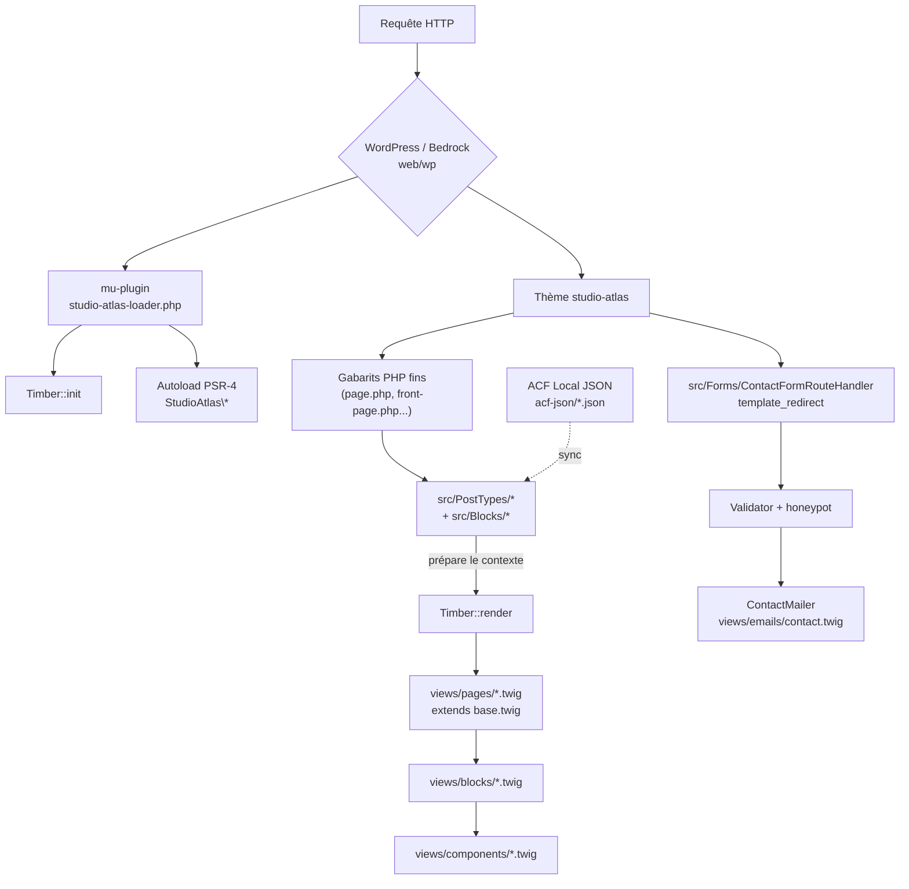

# Studio Atlas — Site vitrine WordPress sur-mesure (Bedrock + Timber + ACF)

Un site vitrine pour une agence fictive d'architecture / design d'intérieur, construit comme une démonstration technique d'une stack WordPress moderne : **Bedrock**, **Timber/Twig** et un vrai page builder **ACF Flexible Content** entièrement versionné.

> Portfolio technique — pas un site de production. Contenu Lorem Ipsum / images placeholder.

## Aperçu du page builder

```
┌──────────────────────────────────────────────┐
│  [Screenshot / GIF à insérer ici]             │
│  Édition d'une page via les 6 blocs ACF       │
│  Flexible Content : Hero, Grille de projets,  │
│  Témoignages, CTA contact, Logos, Équipe.     │
└──────────────────────────────────────────────┘
```

*(Placeholder — à remplacer par une capture réelle de l'admin ACF une fois l'environnement lancé.)*

## Pourquoi Bedrock + Timber plutôt que WordPress classique ?

| Problème du WP "classique" | Réponse apportée ici |
|---|---|
| `wp-config.php` avec secrets committés, pas de séparation d'environnement | **Bedrock** : `.env` non versionné, `config/environments/{dev,staging,production}.php` |
| Plugins committés en dur dans `wp-content`, drift entre machines | Tous les plugins déclarés dans `composer.json` via **WPackagist**, jamais commités |
| `get_header()` / `get_footer()` / PHP mélangé au HTML, logique dans les templates | **Timber/Twig** : les `.php` du thème ne font que préparer un contexte, `.twig` ne fait que du rendu |
| Page builders propriétaires (page builders "visuels" qui polluent le contenu de balises inline) | **ACF Flexible Content** : chaque bloc = une classe PHP + un fichier Twig + un JSON versionné, sans une seule balise `style=""` |
| Configuration ACF perdue si la base de données change (staging ≠ prod) | **ACF Local JSON** : les groupes de champs sont des fichiers versionnés, rejoués automatiquement à chaque environnement |

## Architecture



## Stack

- **Bedrock** (`roots/bedrock`) — structure racine, `web/` en docroot, `web/wp` = core WordPress (composer)
- **Timber 2.x** — toutes les vues en Twig, aucun `get_header()`
- **ACF** — Flexible Content pour le page builder, Local JSON pour la synchronisation (voir plus bas)
- **DDEV** — environnement local reproductible
- **GitHub Actions** — lint PHPCS/WPCS + tests Pest + validation de build

## Installation locale

Prérequis : [DDEV](https://ddev.com/) installé (Docker sous le capot).

```bash
git clone https://github.com/<votre-compte>/wp-bedrock-timber-starter.git
cd wp-bedrock-timber-starter
cp .env.example .env          # renseigner au minimum les clés de sécurité (roots.io/salts.html)
ddev start                    # démarre les conteneurs + exécute `composer install` (hook post-start)
ddev exec wp core install --url=https://studio-atlas.ddev.site --title="Studio Atlas" \
  --admin_user=admin --admin_password=admin --admin_email=admin@example.com
```

Le site est ensuite accessible sur `https://studio-atlas.ddev.site`. Créez une page nommée **"Contact"** (slug `contact`) pour activer le gabarit `page-contact.php`, et une page d'accueil statique pour tester `front-page.twig`.

### Build des assets front

```bash
cd web/app/themes/studio-atlas
npm install
npm run build     # compile assets/styles -> assets/dist/main.css (minifié), idem JS
npm run watch      # pendant le développement
```

### Activer le thème et ACF

```bash
ddev exec wp theme activate studio-atlas
ddev exec wp plugin activate advanced-custom-fields
```

## ACF Local JSON — comment et pourquoi

**Comment** : `src/Support/AcfJsonSync.php` filtre `acf/settings/save_json` et `acf/settings/load_json` pour forcer le point de synchronisation vers `web/app/themes/studio-atlas/acf-json/`, indépendamment du thème actif. Chaque modification d'un groupe de champs dans l'admin WordPress réécrit automatiquement le fichier JSON correspondant sur disque.

**Pourquoi c'est non-négociable ici** :
- **Reproductibilité** : cloner le repo et lancer `ddev start` doit suffire à retrouver *exactement* la même configuration de champs, sans étape manuelle en admin ni export/import CSV.
- **Revue de code** : une modification de champ ACF passe par une Pull Request lisible (diff JSON), au même titre qu'un changement de schéma de base de données.
- **Environnements multiples** : la configuration ACF ne dépend plus de la base de données de chaque environnement (dev/staging/prod peuvent avoir des BDD complètement différentes et rester synchronisées sur les champs).
- **Vitesse** : Local JSON évite les requêtes SQL supplémentaires pour charger la config des champs (ACF lit directement les fichiers).

Chaque CPT (`Project`, `TeamMember`, `Service`) et le page builder ont leur propre fichier dans `acf-json/`, nommés `group_*.json`.

## Structure du repo

```
composer.json                         # Bedrock + Timber + plugins WPackagist + dev (PHPCS/WPCS, Pest)
config/
  application.php                     # config commune (DB, salts, constantes)
  environments/{development,staging,production}.php
web/
  wp-config.php                       # point d'entrée standard Bedrock -> config/application.php
  app/
    mu-plugins/studio-atlas-loader.php  # bootstrap Timber + autoload PSR-4 de src/ + enregistrement CPT/blocs/form
    themes/studio-atlas/
      style.css                       # header du thème uniquement (aucun style réel)
      functions.php                   # theme supports, menus, enqueue, filtre Timber context
      *.php (page.php, front-page.php, single-project.php, page-contact.php...)
                                       # gabarits fins : préparent un contexte, appellent Timber::render()
      acf-json/                       # groupes de champs versionnés (voir section dédiée)
      src/
        Blocks/                       # 1 classe par bloc Flexible Content (register + prepare)
        PostTypes/                    # CPT Project, TeamMember, Service (register_post_type, pas ACF)
        Support/                      # Assets, TimberContext, ImageHelper, AcfJsonSync
        Forms/                        # Validator, ContactMailer, ContactFormRouteHandler
      views/
        components/                   # Hero.twig, ProjectCard.twig, Testimonial.twig, ContactForm.twig...
        partials/                     # head, header, nav, footer
        blocks/                       # 1 twig par layout ACF, n'appelle que des components/
        pages/                        # base.twig (layout), page, front-page, single-project, contact...
        emails/                       # contact.twig (corps de l'email wp_mail)
      assets/
        styles/                       # SCSS organisé en miroir de views/ (base, partials, components, blocks, pages)
        scripts/main.js                # vanilla JS, amélioration progressive du formulaire
.ddev/config.yaml                     # environnement local (PHP 8.2, MariaDB, hook composer install)
.github/workflows/{lint,deploy-staging}.yml
tests/                                # Pest/PHPUnit sur la logique custom uniquement
phpcs.xml                             # WPCS scopé à src/ et functions.php
```

## Tests

Tests **Pest** ciblant exclusivement la logique métier custom — jamais le core WordPress :

- `tests/Unit/ValidatorTest.php` — validation serveur du formulaire de contact (champs requis, format email, détection honeypot)
- `tests/Unit/TestimonialsBlockTest.php` — transformation du répéteur ACF "témoignages" en données Twig
- `tests/Unit/ContactCtaBlockTest.php` — valeurs par défaut du bloc CTA de contact

```bash
composer install
composer run test
```

`tests/bootstrap.php` fournit des stubs minimalistes des quelques fonctions WordPress utilisées (`__()`, `home_url()`, `sanitize_*`...), pour tester la logique en isolation sans bootstrap WordPress complet.

## Performance

- **Lazy-loading natif** (`loading="lazy"`) sur toutes les images des vues (galerie projet, grille de projets, logos clients...)
- **Cache objet** : le plugin `wpackagist-plugin/redis-cache` est déclaré dans `composer.json`. Pour l'activer sous DDEV : ajouter un service Redis (`ddev get ddev/ddev-redis` ou service custom dans `.ddev/docker-compose.redis.yaml`), renseigner `WP_REDIS_HOST`/`WP_REDIS_PORT` dans `.env`, puis `wp plugin activate redis-cache && wp redis enable`.
- **Assets versionnés** : `Assets.php` charge `assets/dist/main.{css,js}` avec un `filemtime()` en query string ; `npm run build` minifie via `sass`/`esbuild`.

## CI/CD

- **`.github/workflows/lint.yml`** : à chaque push/PR — `composer install`, PHPCS (WPCS) sur `src/` et `functions.php`, tests Pest, puis build des assets (`npm run build`) pour valider que rien ne casse la chaîne de compilation.
- **`.github/workflows/deploy-staging.yml`** : stub crédible mais désactivé (`if: false`) — build + `rsync` via SSH vers un serveur staging, piloté par des secrets GitHub (`STAGING_HOST`, `STAGING_USER`, `STAGING_SSH_KEY`, `STAGING_PATH`). Aucun serveur réel n'est fourni avec ce portfolio.

## Compromis assumés (voir aussi le résumé de fin de tâche)

- **ACF Pro** n'est pas installable sans licence commerciale : `composer.json` déclare `wpackagist-plugin/advanced-custom-fields` (version gratuite) comme *placeholder*. Le code (Flexible Content, `get_field()`, Local JSON) cible volontairement l'API ACF Pro — remplacer la dépendance par le zip officiel ACF Pro (repository composer privé ou installation manuelle dans `web/app/plugins/`) ne nécessite aucune modification de code.
- Pas de contenu de production réel (Lorem Ipsum, images placeholder).
- Pas de serveur de staging fonctionnel — le workflow de déploiement est structurellement correct mais désactivé.
